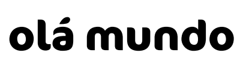
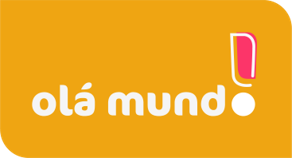
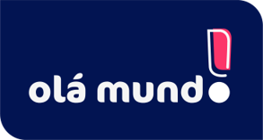
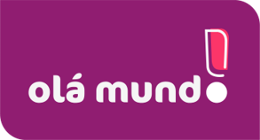
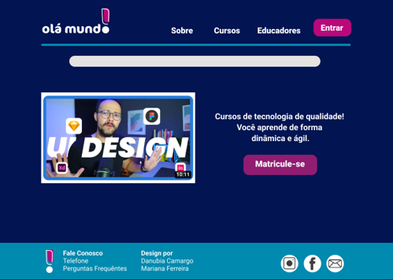
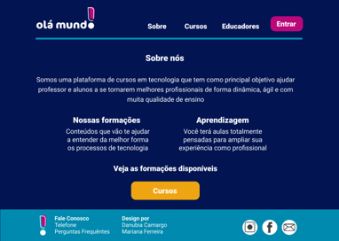
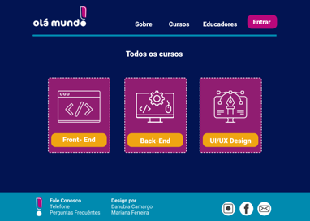
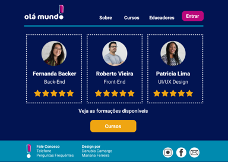
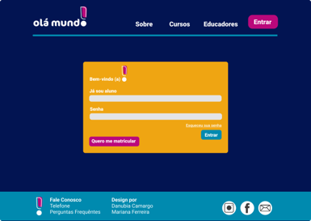
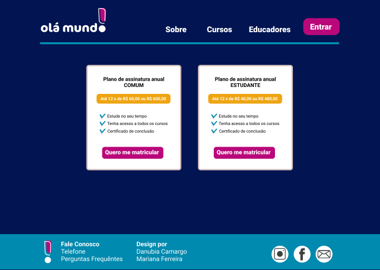

# Olá Mundo!
link do [Projeto Final](https://danubiabcamargo.github.io/senac-projeto-uc1-uc2/)
***

## SUMÁRIO
* Sobre o projeto
*  Identidade
*  Fontes
*  Logos
*  Protótipo
*  Conclusão

  ## SOBRE O PROJETO
  O site Olá mundo é uma plataforma de estudo que tem como principal objetivo ajudar pessoas de baixa renda, entre elas estudantes que desejam aprimorar seus conhecimentos em tecnologia. Além disso, o site é uma ótima forma para professores divulgarem seu trabalho na internet. 

  ## IDENTIDADE
  ### A  identidade visual do site foi pensada para ser prática e intuitiva, para que seus usuários possam ter clareza ao entrar na plataforma
  - A fonte do logo a FF Cocon é descontraída e atual, isso para que os estudantes se sintam mais à vontade ao entrar na plataforma. Para os textos de apoio foram utilizadas a tipografia Roboto, menos cursiva e mais legível

  - As cores usadas se complementam, não geram atrito e desconforto ao usuário, são colocadas em pequenos pontos na plataforma para que os alunos tenham mais foco no conteúdo ensinado

 ## FONTES
         
  
 Fonte: FF Cocon
 
*  Dinâmica
*  Autêntica
*  Divertida 
*  Atual
 

<h2>O melhor site de tecnologia com melhor preço</h2>
<h3>Fonte: Roboto</h3>

* Ótima para leitura em telas; 
* Família tipográfica completa; 
* Contraste ideal com a tipografia usada no logo.

<h1> Logos </h1>
<h2> Logos primários </h2>

<h2> Logo secundário </h2>

<h1> Protótipo </h1>

 

<h1>Conclusão</h1>
O projeto proposto foi pensado e realizado com intuito de criar um site educacional para ajudar pessoas de baixa renda, com foco em estudantes matriculados na rede pública que possuem condições limitadas em cursos pagos.
  

<h2>Etapas:</h2>

* Idealização do projeto;
* Pesquisa: conhecer os possíveis usuários do site e entender 
suas necessidades;
* Protótipo de média e alta fidelidade ; 
* Teste de navegação;
* Realização do projeto com HTML e CSS.

<h1> Senac Lapa Tito </h1>

<h2>Projeto por:</h2>
Danubia Camargo  
Mariana S. Ferreira
  
<h2>Professor:</h2>
Cristiano Maia 